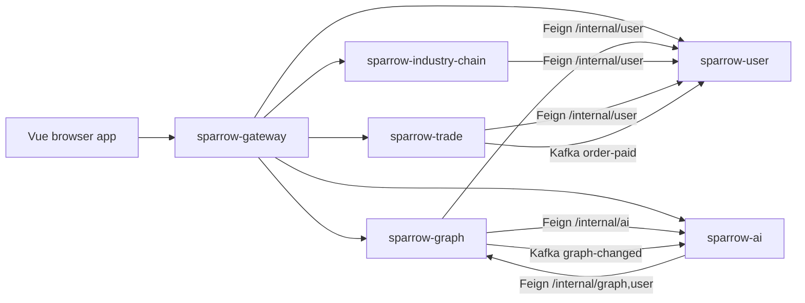

# Architecture map

## Runtime topology

Runtime calls do not imply build-time dependencies. Every business service depends
only on `sparrow-common` inside the Maven reactor.

## Ownership table

| Component | Public path / purpose | Data authority |
| --- | --- | --- |
| gateway | external entry and static frontend | Redis-backed auth lookup; no business tables |
| user | `/api/user/**`, `/internal/user/**` | `sparrow_user` |
| graph | `/api/graph/**`, `/internal/graph/**` | `sparrow_graph`, Neo4j read model |
| trade | `/api/trade/**`, `/api/pay/**` | `sparrow_trade` |
| ai | `/api/ai/**`, `/internal/ai/**` | `sparrow_ai`, Milvus/RAG state |
| industry-chain | `/api/chains/**` | `sparrow_industry_chain`, research run state |
| frontend | browser routes and interaction | no secret or authoritative job state |

Every user-facing AI conversation follows the shared lifecycle contract in
`runtime-ai-chat.md`. Execution and memory stay in the owning service; only sanitized
Harness metadata is shared through `sparrow-common`.

## Enforced constraints

`tools/harness-guard.mjs` checks these rules with actionable remediation:

1. Manifest modules match the Maven reactor and required files exist.
2. Business service POMs do not depend on other business service artifacts.
3. Java source does not import another service's package directly.
4. A frontend business module does not import another business module.
5. Agent maps, verification docs and task state are structurally valid.
6. Local secret files are not tracked.

`tools/architecture-guard.mjs` retains product-specific anti-regression rules for
the retired static industry-chain implementation.

## Direction, not false purity

The current code is a brownfield layered system: some application classes directly
use infrastructure types, and graph DTOs cross internal layers. Do not enable a
strict theoretical layer rule that creates hundreds of unactionable warnings.
New code should move toward ports at application boundaries. Promote a direction to
a deterministic guard only after the touched area conforms or an explicit baseline
strategy exists.

## Architecture change protocol

Any new service, database, cross-service call, frontend module or public route must
update all of the following in one change:

- `.harness/manifest.json` and this map;
- Maven reactor / gateway route / Compose definitions as applicable;
- architecture guard rules;
- focused contract or structural tests;
- deployment and operational verification.
