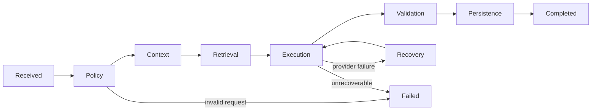

# Runtime Harness for AI chat

Repository Harness controls coding agents; runtime AI Harness controls every
user-facing model conversation. They use the same idea—bounded context, explicit
state, deterministic sensors and recoverable execution—but operate at different
times.

## Surface ownership

| Surface | Owning service | Durable memory |
| --- | --- | --- |
| Graph-side AI rail | `sparrow-ai` | `chat_session` + atomic message exchanges |
| Graph dialog workbench | `sparrow-ai` | A workbench-created `chat_session` |
| Industry-chain guide rail | `sparrow-ai` | `chat_session` + atomic message exchanges |
| Industry-chain planning dialog | `sparrow-industry-chain` | `research_message` on the owned card |

The services share only `com.sparrow.common.ai.AiHarness` lifecycle metadata. They
do not import another business service or share databases.

## Lifecycle

All runs receive a server-generated `traceId` and low-cardinality `surface`.
Metadata contains sanitized stage details only—never prompts, API keys, provider
payloads or stack traces.

## Context and state

- General chat defaults to 12 persisted messages / 6000 characters; the owning
  service applies the administrator-configured bounds for new requests.
- Industry planning defaults to 12 persisted card messages / 8000 characters and
  applies its own service-owned administrator configuration.
- Graph workbench creates a server-side chat session on its first question so later
  turns have real memory rather than browser-only appearance.
- The current question is not written before generation. A successful user/assistant
  pair is written in one transaction after validation, preventing orphan turns.
- Refresh recovery reads persisted messages. SSE is transport and observation, not
  the authoritative state store.

## Streaming contract

`sparrow-ai` emits the following SSE events:

| Event | Meaning |
| --- | --- |
| `harness` | Lifecycle snapshot; UI updates the visible phase and trace |
| `meta` | Mode, intent, sources, steps, quota and Harness snapshot |
| `thinking` | Optional reasoning delta |
| `delta` | Answer delta |
| `reset` | Current provider failed; discard partial output before fallback |
| `done` | Validated response persisted; includes terminal Harness metadata |
| `error` | Explicit retryability, trace ID and failed Harness metadata |

A transport close without `done` or `error` is an interrupted, retryable failure.
The frontend must not count it as a successful persisted exchange.

## Output sensors and recovery

- Empty output becomes an explicit reliability fallback.
- Oversized output is bounded and carries a warning.
- Agent failure falls back to RAG; RAG failure falls back to local graph rules.
- Partial tokens from a failed provider are reset before the next path starts.
- Terminal state is `completed`, `degraded`, or `failed`; the UI displays it with a
  short trace ID and retains the full ID in the tooltip/error.
- A run with a session ID may emit `done` only after the complete exchange commits.
  Persistence failure is a retryable `error`/`failed` terminal state, even when answer
  deltas were already delivered; the client must not increment durable message counts.

## Extension rule

Any new AI input surface must declare a stable `surface`, use an owning service's
runtime Harness, provide bounded durable context, validate output, persist complete
turns atomically, expose retryability, and add a focused test for its recovery path.
It must also register a service-owned Agent profile as described in
`admin-agent-config.md`; hard-coded prompts are only reviewed fallback defaults.
